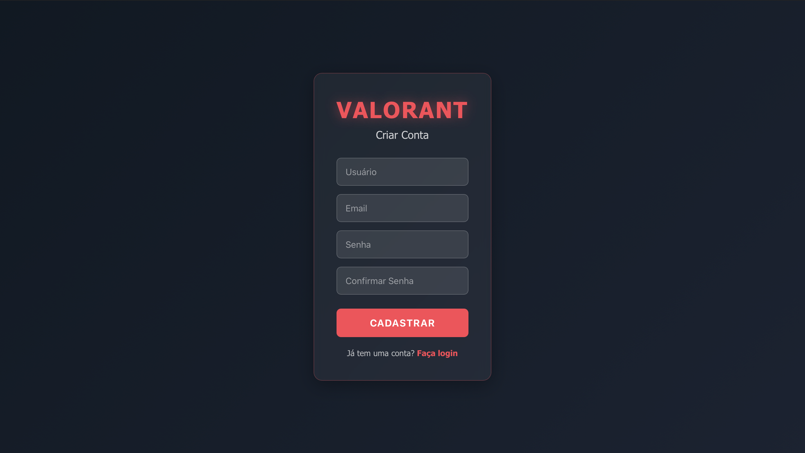
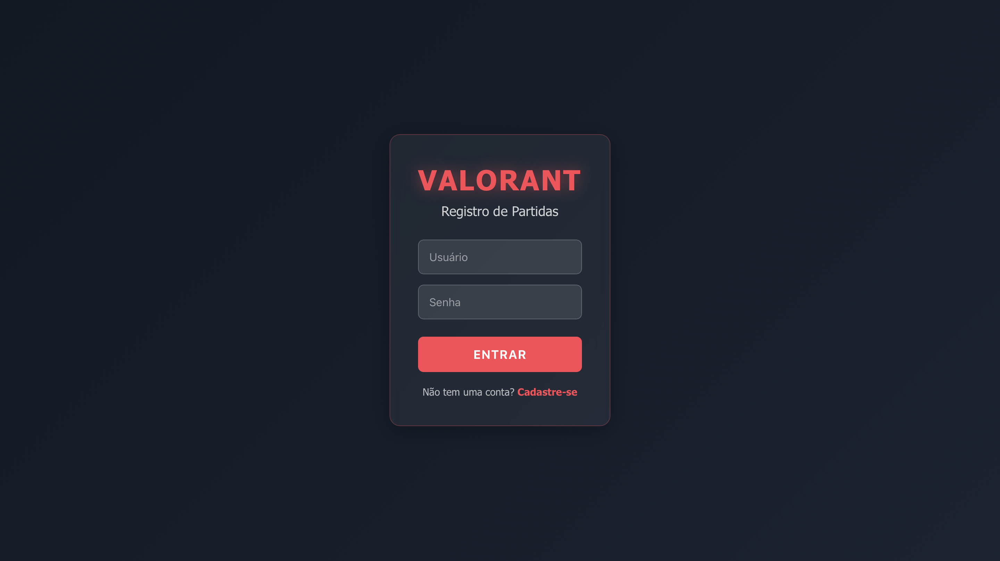
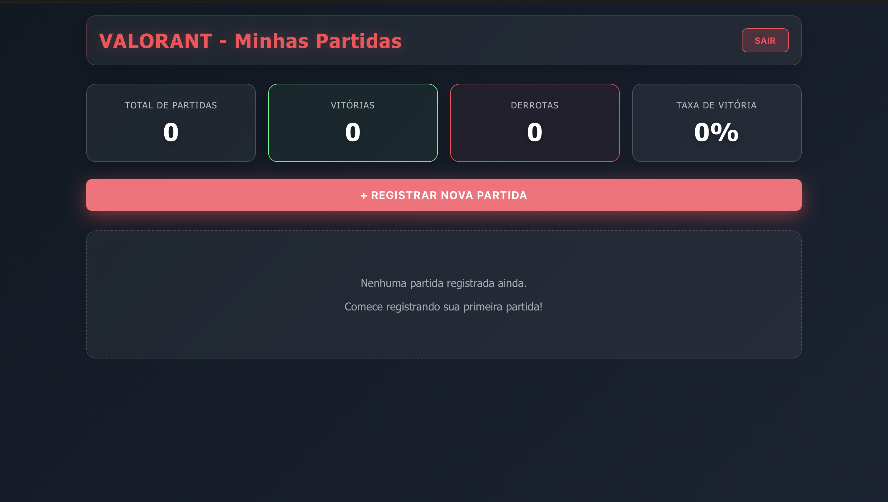
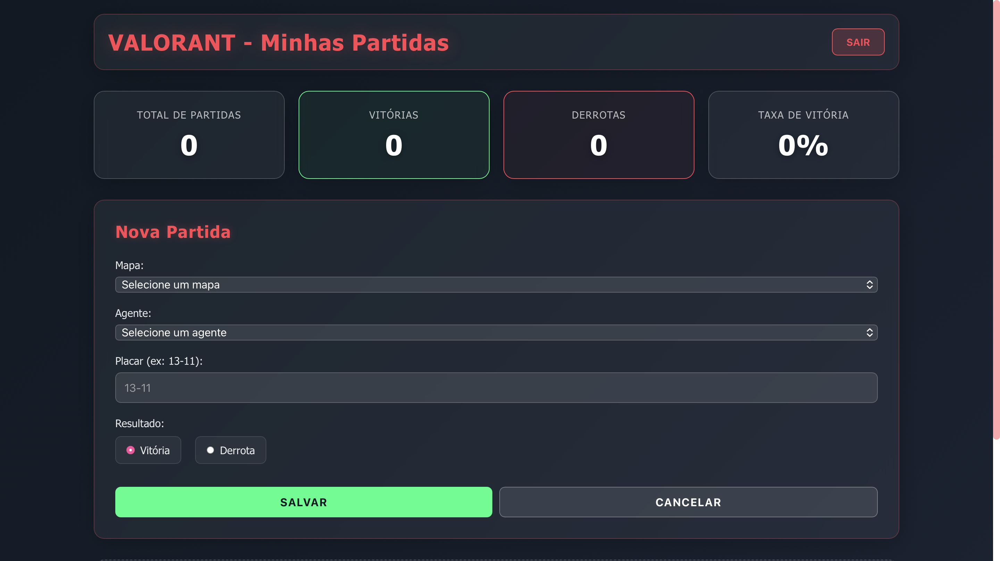
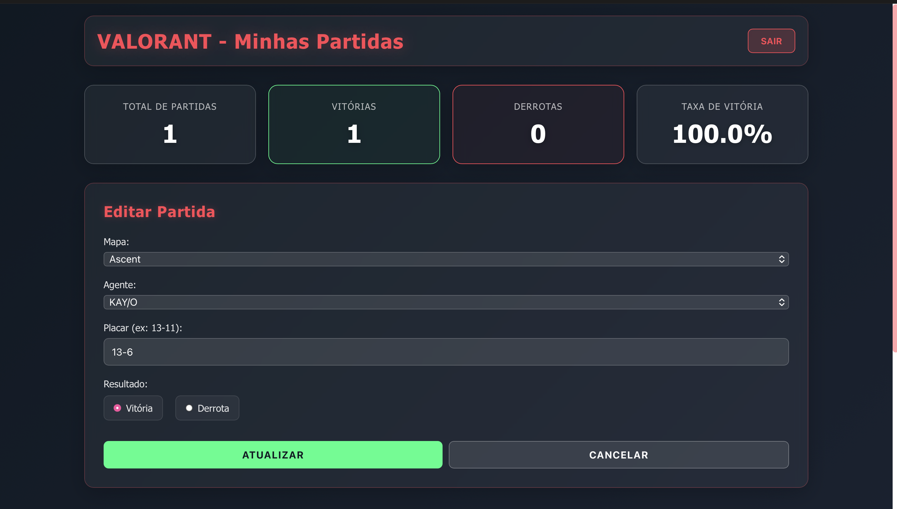
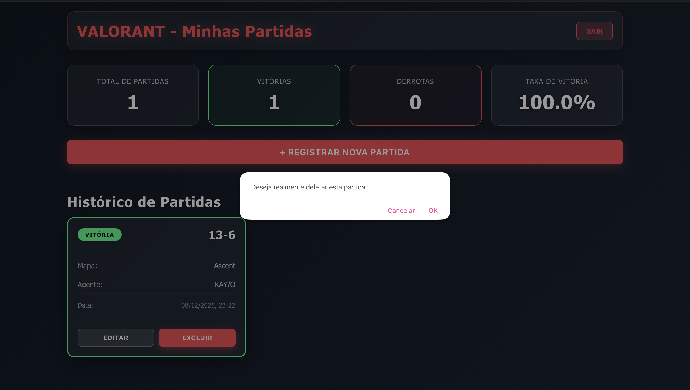
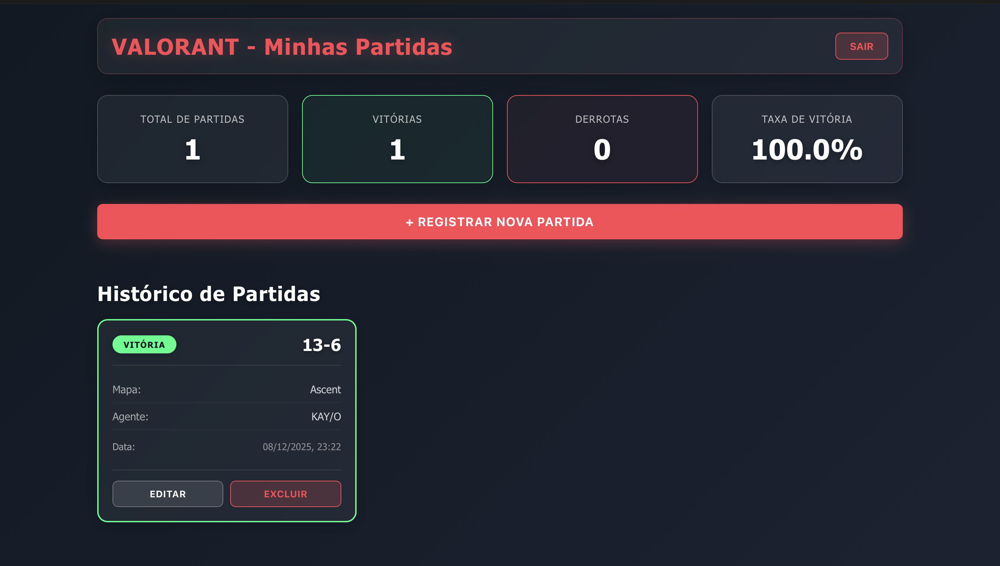

# 🎮 Valorant Match 

O Valorant Match é uma aplicação web que permite aos jogadores de Valorant registrarem suas partidas, incluindo informações como mapa jogado, agente utilizado, placar e resultado. O sistema oferece autenticação de usuários, estatísticas e integração com a API oficial da Riot Games para obter dados atualizados de mapas e agentes.

### Principais Funcionalidades:
- ✅ Sistema de autenticação (login e cadastro)
- ✅ Registro completo de partidas (CRUD)
- ✅ Visualização de estatísticas (vitórias, derrotas, taxa de vitória)
- ✅ Integração com API oficial do Valorant
- ✅ Validações de formulários

---

## 🛠️ Tecnologias Utilizadas

## Backend

### **server.js**

Configura o servidor:

* Express + CORS
* Rotas de autenticação, partidas e Valorant
* Porta 3000

### **config/valorantApi.js**

* Conexão com API da Riot
* Retorna mapas e agentes
* Usa API Key definida no `.env`

### **models**

* **User:** id, username, email, password hash
* **Match:** id, email do usuário, mapa, agente, placar, resultado, data

### **Autenticação**

* **POST /auth/login:** valida usuário/senha, usa bcrypt e gera JWT
* **POST /auth/create:** valida dados, checa duplicidade, salva usuário

**Validações:**
Campos obrigatórios, email válido, username único, senha ≥ 4 caracteres.

### **Partidas**

CRUD completo com autenticação JWT:

* **GET /matches:** lista partidas do usuário
* **POST /matches:** cria partida
* **PUT /matches/:id:** atualiza partida
* **DELETE /matches/:id:** remove partida

### **API Valorant**

* **GET /valorant/content:** retorna mapas e agentes oficiais

### **Banco de Dados**

* `db/users.json` e `db/matches.json` armazenam usuários e partidas

---

## Frontend

### **App.js**

* Gerencia login, rotas e armazenamento do token

### **Login**

* Validação de campos
* Envia credenciais para `/auth/login`
* Armazena token

### **Register**

* Validação completa
* Envio para `/auth/create`
* Redirecionamento pós-cadastro

### **Dashboard**

* Estatísticas: vitórias, derrotas, taxa
* Lista de partidas
* Botão para adicionar partida
* Logout

### **MatchForm**

* Busca mapas/agentes pela API
* Cria e edita partidas
* Valida placar

### **MatchList**

* Cards com partidas
* Botões de editar e excluir
* Estilo visual para vitória/derrota
* Data formatada

---

## ▶️ Como Rodar

### Backend

```bash
cd backend
npm install
node server.js
```

Crie `.env`:

```
TOKEN=seu_token_jwt
RIOT_API_KEY=sua_chave_riot
```

### Frontend

```bash
cd frontend
npm install
npm start
```

Acesse:
`http://localhost:3000`

---

## 📊 Fluxo de Uso

1. **Primeiro Acesso:**
   - Usuário clica em "Cadastre-se"
   - Preenche: usuário, email, senha, confirmar senha
   - Sistema valida e cria conta
   - Redirecionado para login
   

2. **Login:**
   - Usuário entra com username e senha
   - Sistema valida e gera token
   - Redirecionado para Dashboard
   

3. **Dashboard:**
   - Visualiza estatísticas gerais
   - Vê histórico de partidas
   - Clica em "Registrar Nova Partida"
   

4. **Registrar Partida:**
   - Seleciona mapa (via API Riot)
   - Seleciona agente (via API Riot)
   - Informa placar (ex: 13-11)
   - Marca vitória ou derrota
   - Clica em Salvar
   

5. **Gerenciar Partidas:**
   - Editar: Clica em "Editar", altera dados, salva
   
   - Excluir: Clica em "Excluir", confirma exclusão
   
   - Visualizar: Scroll pela lista de partidas
   
   
6. **Logout:**
   - Clica em "Sair"
   - Retorna para login

---

### Paleta de Cores:
- **Primary:** #ff4655 (Vermelho Valorant)
- **Success:** #00ff88 (Verde vitória)
- **Background:** Gradient #0f1923 → #1a2332

---

## 👨‍💻 Autor

Projeto desenvolvido como aprendizado de Programação Web por Ana Clara Caetano, estudande de Sistemas de Infomeção e Analista de Projetos.
*https://github.com/caeqs*
*https://www.linkedin.com/in/anaclara-caetano/*

---

## 🎮 Valorant - Riot Games

Este projeto é de código aberto para fins educacionais.